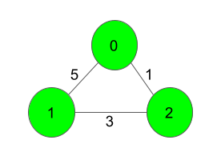
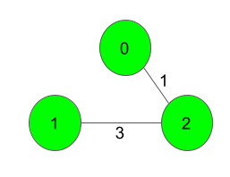

# Prim's Algorithm - Minimum Spanning Tree (MST)

## 💡 Hint
Min-Heap, Visited, Smallest Edge, No Cycles, V - 1 Edges, Priority Queue.

## 📌 Introduction
**Prim’s Algorithm** is a greedy algorithm used to find the **Minimum Spanning Tree (MST)** of a weighted, undirected, and connected graph. It ensures that all vertices are connected with the least possible edge weight while avoiding cycles.

## ✨ Properties of Prim's Algorithm
✔ **Starts with a single vertex** and expands by adding the smallest edge that connects a new vertex.

✔ **Uses a priority queue (min-heap)** to efficiently select the smallest edge.

✔ **Maintains a visited set** to avoid cycles.

✔ **Works well for dense graphs** (when E is close to V²) using an adjacency matrix.

✔ **Ensures MST construction** with `V - 1` edges.

## 🛠 Steps to Implement Prim’s Algorithm
1️⃣ Start from any vertex and initialize a **min-heap** with its edges.

2️⃣ Extract the edge with the **minimum weight** from the heap.

3️⃣ If the edge leads to an **unvisited vertex**, add it to the MST and push all its edges into the heap.

4️⃣ Repeat until **V - 1** edges are added to the MST.

## 🏗 Use Cases
✔ **Network Design:** Used in designing computer networks, telecommunication networks, and road networks.

✔ **Cluster Analysis:** Helps in data clustering techniques.

✔ **Approximation Algorithms:** Used in solving NP-hard problems like the traveling salesman problem.

✔ **Image Segmentation:** Applied in image processing and vision-based applications.

✔ **Electric Grid Systems:** Ensures efficient electricity distribution with minimal wiring cost.

## ⏳ Time Complexity
- **Using Min-Heap & Adjacency List:** `O((V + E) log V)`, but when `E` is near `V²`, it approaches `O(V² log V)`.
- **Using Adjacency Matrix:** `O(V²)`, suitable for dense graphs.

## 🚀 Example of Prim’s Algorithm
### **Input Graph:**


### **MST Edges Selected:**


**Total MST Weight: 4**

## 📌 Code Implementation
🔗 **Check out the implementation here:** [Prim’s Algorithm Code, With Test Cases](Prims-Algorithm.py)

```python
import heapq
from typing import List

class Solution:
    # Function to find sum of weights of edges of the Minimum Spanning Tree.
    def spanningTree(self, V: int, adj: List[List[List[int]]]) -> int:
        vis = set()
        mst_hq = [(0, 0, -1)]  # (cost, node, parent)
        heapq.heapify(mst_hq)
        sm = 0
        mst_edges = []

        while len(mst_hq) > 0:
            cost, node, parent = heapq.heappop(mst_hq)
            if node in vis:
                continue
            vis.add(node)
            sm += cost
            if parent != -1:
                mst_edges.append((parent, node, cost))
            
            for neighbor, edge_cost in adj[node]:
                if neighbor not in vis:
                    heapq.heappush(mst_hq, (edge_cost, neighbor, node))
        print(mst_edges)
        return sm
```

## 📚 References
🔗 **Video Explanation** by Gate Smashers: [Watch Here](https://www.youtube.com/watch?v=_KX8GDvRzBc)

📝 Feel free to contribute to this repository or suggest improvements! 😊

