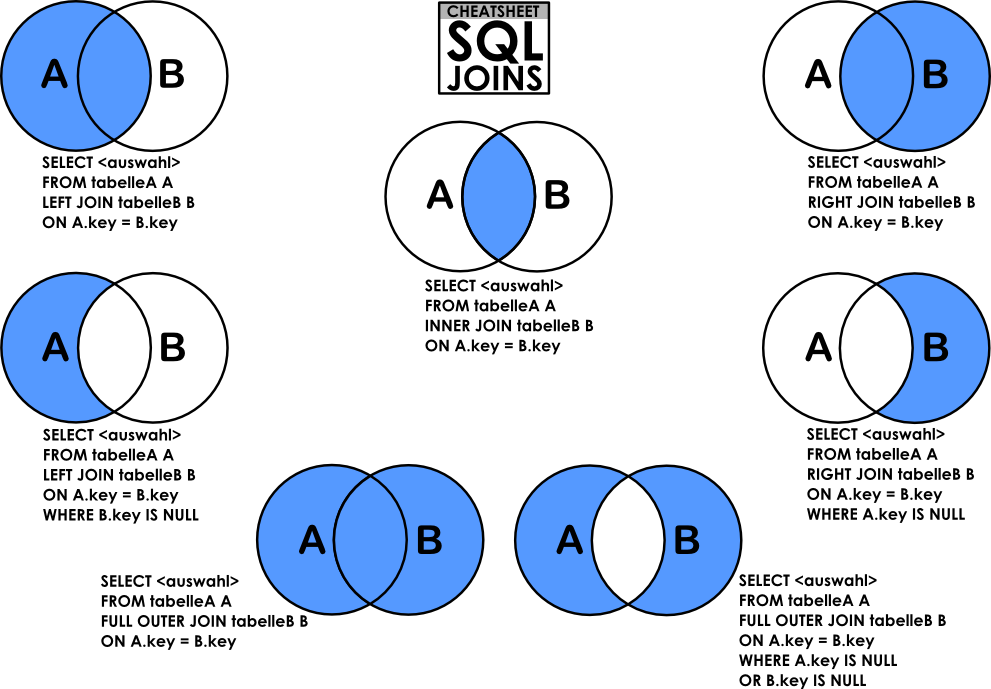

# SQL Learning Roadmap

Welcome to the SQL Learning Roadmap! This repository contains structured notes to help you master SQL step by step.

## Table of Contents

1.  [SQL Queries](#sql-queries)
    1.  [Data Definition Language (DDL)](#11-data-definition-language-ddl)
    2.  [Data Manipulation Language (DML)](#12-data-manipulation-language-dml)
    3.  [Data Control Language (DCL)](#13-data-control-language-dcl)
    4.  [Data Query Language (DQL)](#14-data-query-language-dql)
2.  [Advanced SQL Concepts](#advanced-sql-concepts)
    1.  [Aggregate Functions](#21-aggregate-functions)
    2.  [Joins](#22-joins)
    3.  [Subqueries](#23-subqueries)
    4.  [Advanced SQL Functions](#24-advanced-sql-functions)
    5.  [Transactions](#25-transactions)
    6.  [Data Integrity and Security](#26-data-integrity-and-security)
    7.  [Stored Procedures and Functions](#27-stored-procedures-and-functions)
    8.  [Performance Optimization](#28-performance-optimization)
    9.  [Advanced SQL Concepts](#29-advanced-sql-concepts)

## 1. SQL Queries

### 1.1 Data Definition Language (DDL)

DDL is used to define and manage database structures.

* **CREATE TABLE** - Defines a new table.

    ```sql
    CREATE TABLE employees (
        id INT PRIMARY KEY,
        name VARCHAR(100),
        age INT,
        department_id INT
    );

    CREATE TABLE departments (
        id INT PRIMARY KEY,
        name VARCHAR(100)
    );
    ```

* **ALTER TABLE** - Modifies an existing table.

    ```sql
    ALTER TABLE employees ADD COLUMN salary DECIMAL(10,2);
    ALTER TABLE employees MODIFY COLUMN name VARCHAR(255);
    ALTER TABLE employees DROP COLUMN age;
    ALTER TABLE employees ADD CONSTRAINT fk_department FOREIGN KEY (department_id) REFERENCES departments(id);
    ```

* **DROP TABLE** - Deletes a table permanently.

    ```sql
    DROP TABLE employees;
    ```

* **TRUNCATE TABLE** - Removes all records but keeps the structure.

    ```sql
    TRUNCATE TABLE employees;
    ```

* **CREATE INDEX** - creates index for faster query.

    ```sql
    CREATE INDEX idx_name ON employees(name);
    ```

* **DROP INDEX** - removes an index.

    ```sql
    DROP INDEX idx_name ON employees;
    ```

### 1.2 Data Manipulation Language (DML)

DML is used to manage data within tables.

* **INSERT** - Adds new records to tables.

    ```sql
    INSERT INTO employees (id, name, department_id, salary) VALUES (1, 'John Doe', 1, 50000);
    INSERT INTO departments (id, name) VALUES (1, 'HR');
    ```

* **UPDATE** - Modifies existing records.

    ```sql
    UPDATE employees SET salary = 60000 WHERE id = 1;
    ```

* **DELETE** - Removes specific records.

    ```sql
    DELETE FROM employees WHERE id = 1;
    ```

### 1.3 Data Control Language (DCL)

DCL is used to manage user permissions and security.

* **GRANT** - Grants privileges to users.

    ```sql
    GRANT SELECT, INSERT ON employees TO user1;
    ```

* **REVOKE** - Removes granted privileges.

    ```sql
    REVOKE INSERT ON employees FROM user1;
    ```

### 1.4 Data Query Language (DQL)

DQL is used to query data from tables.

* **SELECT** - Retrieves data from a table.

    ```sql
    SELECT * FROM employees;
    ```

* **WHERE** - Filters records based on conditions.

    ```sql
    SELECT * FROM employees WHERE salary > 50000;
    ```

* **ORDER BY** - Sorts query results.

    ```sql
    SELECT * FROM employees ORDER BY salary DESC;
    ```

* **GROUP BY** - Groups records by a column.

    ```sql
    SELECT department_id, COUNT(*) FROM employees GROUP BY department_id;
    ```

* **HAVING** - Filters grouped records.

    ```sql
    SELECT department_id, COUNT(*) FROM employees GROUP BY department_id HAVING COUNT(*) > 1;
    ```

* **JOINS** - Combines records from multiple tables.

    ```sql
    SELECT employees.name, departments.name FROM employees INNER JOIN departments ON employees.department_id = departments.id;
    ```

* **LIMIT/OFFSET** - Paginates results.

    ```sql
    SELECT * FROM employees LIMIT 10 OFFSET 20;
    ```

* **DISTINCT** - returns unique values.

    ```sql
    SELECT DISTINCT department_id FROM employees;
    ```

* **LIKE** - pattern matching.

    ```sql
    SELECT * FROM employees WHERE name LIKE 'John%';
    ```

* **IN** - check in a set of values.

    ```sql
    SELECT * FROM employees WHERE department_id IN (1,2,3);
    ```

* **BETWEEN** - check between two values.

    ```sql
    SELECT * FROM employees WHERE salary BETWEEN 50000 and 70000;
    ```

* **IS NULL/ IS NOT NULL** - check for null values.

    ```sql
    SELECT * FROM employees WHERE department_id IS NULL;
    ```

* **CASE WHEN THEN ELSE END** - conditional logic.

    ```sql
    SELECT name,
        CASE
            WHEN salary > 60000 THEN 'High Salary'
            WHEN salary > 50000 THEN 'Medium Salary'
            ELSE 'Low Salary'
        END AS salary_category
    FROM employees;
    ```

## 2. Advanced SQL Concepts

### 2.1 Aggregate Functions

* **SUM** - Calculates the total sum of a column.

    ```sql
    SELECT SUM(salary) FROM employees;
    ```

* **AVG** - Finds the average value.

    ```sql
    SELECT AVG(salary) FROM employees;
    ```

* **COUNT** - Counts the number of records.

    ```sql
    SELECT COUNT(*) FROM employees;
    ```

* **MIN** - Finds the minimum value.

    ```sql
    SELECT MIN(salary) FROM employees;
    ```

* **MAX** - Finds the maximum value.

    ```sql
    SELECT MAX(salary) FROM employees;
    ```

### 2.2 Joins



* **INNER JOIN** - Returns matching records from both tables.

    ```sql
    SELECT employees.name, departments.name FROM employees INNER JOIN departments ON employees.department_id = departments.id;
    ```

* **LEFT JOIN** - Returns all records from the left table, plus matches.

    ```sql
    SELECT employees.name, departments.name FROM employees LEFT JOIN departments ON employees.department_id = departments.id;
    ```

* **RIGHT JOIN** - Returns all records from the right table, plus matches.

    ```sql
    SELECT employees.name, departments.name FROM employees RIGHT JOIN departments ON employees.department_id = departments.id;
    ```

* **FULL OUTER JOIN** - Returns all records from both tables.

    ```sql
    SELECT employees.name, departments.name FROM employees FULL OUTER JOIN departments ON employees.department_id = departments.id;
    ```

* **Self Join** - Joins a table with itself.

    ```sql
    SELECT A.name, B.name FROM employees A, employees B WHERE A.department_id = B.department_id;
    ```

* **Cross Join** - Returns Cartesian product of two tables.

    ```sql
    SELECT * FROM employees CROSS JOIN departments;
    ```

### 2.3 Subqueries

* **Types of Subqueries** - Scalar, column, row, table.

    ```sql
    SELECT name FROM employees WHERE department_id = (SELECT id FROM departments WHERE name = 'HR');
    ```

* **Nested Subqueries** - Queries within queries.

    ```sql
    SELECT name FROM employees WHERE salary = (SELECT MIN(salary) FROM (SELECT salary FROM employees WHERE department_id = 1) AS temp);
    ```

* **Correlated Subqueries** - Depends on outer query.

    ```sql
    SELECT name FROM employees e WHERE EXISTS (SELECT 1 FROM departments d WHERE d.id = e.department_id AND d.name = 'HR');
    ```

### 2.4 Advanced SQL Functions

* **String Functions**
    * **CONCAT** - Combines strings.

        ```sql
        SELECT CONCAT(name, ' (', id, ')') FROM employees;
        ```

    * **LENGTH** - Returns string length.

        ```sql
        SELECT LENGTH(name) FROM employees;
        ```

    * **SUBSTRING** - Extracts part of a string.

        ```sql
        SELECT SUBSTRING(name, 1, 3) FROM employees;
        ```

    * **REPLACE** - Replaces text in a string.

        ```sql
        SELECT REPLACE(name, 'John', 'Mike') FROM employees;
        ```

    * **UPPER** - Converts text to uppercase.

        ```sql
        SELECT UPPER(name) FROM employees;
        ```

    * **LOWER** - Converts text to lowercase.

        ```sql
        SELECT LOWER(name) FROM employees;
        ```

    * **TRIM** - removes extra spaces.

        ```sql
        SELECT TRIM(' Hello ');
        ```

* **Date Functions**
    * **NOW()** - current timestamp.

        ```sql
        SELECT NOW();
        ```

    * **DATE()** - extracts date part.

        ```sql
        SELECT DATE(NOW());
        ```

    * **YEAR(), MONTH(), DAY()** - extracts date parts.

        ```sql
        SELECT YEAR(NOW());
        ```

* **Mathematical Functions**
    * **ROUND()** - rounds a number.

        ```sql
        SELECT ROUND(salary, 2) FROM employees;
        ```

    * **ABS()** - absolute value.

        ```sql
        SELECT ABS(-10);
        ```

### 2.5 Transactions

* **ACID** - Atomicity, Consistency, Isolation, Durability.
* **BEGIN** - Starts a transaction.

    ```sql
    BEGIN;
    UPDATE employees SET salary = 70000 WHERE id = 1;
    COMMIT;
    ```

* **COMMIT** - Saves the transaction.

    ```sql
    COMMIT;
    ```

* **ROLLBACK** - Reverts the transaction.

    ```sql
    ROLLBACK;
    ```

* **SAVEPOINT** - Creates savepoints in transactions.

    ```sql
    SAVEPOINT sp1;
    ```

* **Transaction Isolation Levels** - Defines how transactions interact with each other.

    ```sql
    SET TRANSACTION ISOLATION LEVEL SERIALIZABLE;
    ```

### 2.6 Data Integrity and Security

* **Data Integrity Constraints** (referential integrity, entity integrity, check constraints, unique constraints, not null)

    ```sql
    CREATE TABLE department (
        id INT PRIMARY KEY,
        name VARCHAR(100) UNIQUE,
        CONSTRAINT fk_employee FOREIGN KEY (id) REFERENCES employees(department_id),
        CHECK (id > 0)
    );
    ```

* **GRANT and REVOKE** - Granting and revoking permissions.

    ```sql
    GRANT SELECT, UPDATE ON employees TO user1;
    REVOKE SELECT ON employees FROM user1;
    ```

* **Database Security Best Practices**.

### 2.7 Stored Procedures and Functions

* **Creating stored procedures**.

    ```sql
    CREATE PROCEDURE IncreaseSalary(IN emp_id INT, IN increment DECIMAL)
    BEGIN
        UPDATE employees SET salary = salary + increment WHERE id = emp_id;
    END;
    ```

* **Executing stored procedures**.

    ```sql
    CALL IncreaseSalary(1, 10000);
    ```

* **Creating functions**.

    ```sql
    CREATE FUNCTION GetSalary(emp_id INT) RETURNS DECIMAL
    BEGIN
        RETURN (SELECT salary FROM employees WHERE id = emp_id);
    END;
    ```

* **Using functions in queries**.

    ```sql
    SELECT GetSalary(1);
    ```

### 2.8 Performance Optimization

* **Query optimization techniques**.
* **Using indexes**.

    ```sql
    CREATE INDEX idx_salary ON employees(salary);
    ```

* **Optimizing joins**.

    ```sql
    SELECT employees.name, departments.name FROM employees JOIN departments ON employees.department_id = departments.id WHERE departments.name = 'HR';
    ```

* **Reducing subqueries**.
* **Performance Tuning Best Practices**.
* **EXPLAIN PLAN** - analyzes query performance.

    ```sql
    EXPLAIN SELECT * FROM employees WHERE salary > 50000;
    ```

### 2.9 Advanced SQL Concepts

* **Recursive Queries**.

    ```sql
    WITH RECURSIVE subordinates AS (
        SELECT id, name, department_id FROM employees WHERE department_id IS NULL
        UNION ALL
        SELECT e.id, e.name, e.department_id FROM employees e
        INNER JOIN subordinates s ON e.department_id = s.id
    )
    SELECT * FROM subordinates;
    ```

* **Pivot and Unpivot Operations**.
* **Window Functions**.
    * **ROW_NUMBER**.
    * **RANK**.
    * **DENSE_RANK**.
    * **LEAD**.
    * **LAG**.

        ```sql
        SELECT name, RANK() OVER (ORDER BY salary DESC) FROM employees;
        ```

* **Common Table Expressions (CTEs)**.

    ```sql
    WITH department_avg_salary AS (
        SELECT department_id, AVG(salary) AS avg_salary FROM employees GROUP BY department_id
    )
    SELECT e.name, e.salary, d.avg_salary FROM employees e JOIN department_avg_salary d ON e.department_id = d.department_id;
    ```

* **Dynamic SQL**.

    ```sql
    SET @sql = CONCAT('SELECT * FROM employees WHERE salary > ', 50000);
    PREPARE stmt FROM @sql;
    EXECUTE stmt;
    DEALLOCATE PREPARE stmt;
    ```

* **Cursors** - allows row by row processing.

    ```sql
    DECLARE done INT DEFAULT FALSE;
    DECLARE emp_name VARCHAR(255);
    DECLARE cur CURSOR FOR SELECT name FROM employees;
    DECLARE CONTINUE HANDLER FOR NOT FOUND SET done = TRUE;
    OPEN cur;
    read_loop: LOOP
        FETCH cur INTO emp_name;
        IF done THEN
            LEAVE read_loop;
        END IF;
        SELECT emp_name;
    END LOOP;
    CLOSE cur;
    ```